# Product Requirement Document (PRD) & User Stories: MentalPath Advanced Suite

**Author:** Antigravity (Advanced AI Coding Assistant, Google DeepMind)  
**Date:** May 18, 2026  
**Status:** 📝 UNDER REVIEW  
**Priority:** 🔴 P0 Critical (Core Platform Specs)  
**Compliance Standard:** PHIPA (Ontario), PIPEDA (Canada), CRPO Standards of Practice  

---

## 🎯 Executive Summary & Vision

MentalPath is a modern, premium practice companion designed specifically for Canadian psychotherapists. Unlike general-purpose Electronic Medical Record (EMR) software that focus solely on operational throughput or cold clinical checkboxes, MentalPath is built to enhance the therapeutic alliance, streamline clinical writing with ethical AI, and directly address the **emotional wellbeing and burnout prevention** of the therapist themselves.

This document serves as the master Product Requirement Document (PRD) and detailed User Story register for the MentalPath Advanced Suite, covering three core product pillars:
1. **Advanced Clinical and Analytical Tools:** Client Safety Plans, AI Referral Letters, AI Discharge Summaries, Session Prep, and Outcome Measures (PHQ-9/GAD-7 trend tracking).
2. **Operational & Practice Management:** A priority-based Waitlist Management system, No-Show Tracker, T2125 Canadian tax-ready billing dashboard, and Stripe Solo/Group subscription models.
3. **Wellbeing & Privacy Ecosystem:** An isolated, secure Therapist Wellbeing check-in (modeled on ProQOL-5 research) and an encrypted, interactive Client Portal.

---

## 🗺️ System Map & User Persona Matrix

```mermaid
graph TD
    %% Personas
    T[Therapist Persona: Dr. Abena Osei-Mensah] -->|Manages| C[Client Persona: Noah/Emily]
    T -->|Manages Practice| P[Practice Lead Persona: Group Admin]
    
    %% Core Modules
    subgraph MentalPath Application
        direction TB
        DB[(Secure Supabase DB)]
        
        subgraph Clinical Hub
            CT[Clinical Tools: Safety Plans, Referrals, Discharge]
            OM[Outcome Measures: PHQ-9 / GAD-7 Trends]
            SP[Session Prep AI & No-Show Tracker]
        end
        
        subgraph Practice Hub
            WL[Waitlist Management Modals]
            BT[Billing, Subscription & T2125 Tax]
        end
        
        subgraph Therapist Health
            WB[Therapist Wellbeing ProQOL Sliders]
        end
        
        subgraph Client Access
            CP[Client Portal: Wellness Check-ins & Secure Chat]
        end
    end
    
    %% Integrations
    CT -->|Edge Functions| OpenAI[OpenAI/Claude API]
    BT -->|Subscription Checkout| Stripe[Stripe Billing API]
    CP -->|Secure Messages| DB
    WB -->|RLS-Isolated Rows| DB
```



### User Personas

| Persona | Role | Primary Goals | Key Pain Points |
| :--- | :--- | :--- | :--- |
| **Dr. Abena Osei-Mensah** | Solo Registered Psychotherapist (RP) | Wants to spend more time in session and less on clinical administrative overhead, while keeping detailed records that meet CRPO audit criteria. | Compassion fatigue, administrative burnout (2-3 hours/day writing summaries), lack of clean tracking for clinical outcomes. |
| **Noah / Emily** | Clinical Clients | Need a warm, low-friction portal to coordinate sessions, access coping tools, and track their progress without clinical pathologization. | Cold, complex client portals, lack of mobile-friendly crisis safety plans, hard to track if therapy is actually helping. |
| **Group Practice Lead** | Clinic Director | Wants to coordinate waitlists, manage clinician subscriptions, and verify practice compliance indicators without viewing sensitive clinical notes. | Complicated licensing fees, slow waitlist conversions, lack of aggregated practice-level tax statistics. |

---

## 🔒 Security, Privacy & PHIPA Compliance Architecture

To maintain the highest ethical and regulatory standards in Canada, the MentalPath Advanced Suite is engineered with a strict **security-first privacy architecture**:

1. **Row-Level Security (RLS):** Enabled on all tables. Therapists can only access data belonging to their verified `auth.uid()`.
2. **Isolation of Therapist Wellbeing Data:** The `therapist_checkins` table is entirely isolated. There are *no joins* to client records. Reflection entries are never logged in system audit logs and cannot be shared or exported, guaranteeing 100% genuine privacy.
3. **No PII in URLs:** All client navigation routes use secure UUIDv4 identifiers or local states. No Personally Identifiable Information (PII) is passed in query parameters or URL paths.
4. **Canadian Data Residency:** All databases, storage buckets, and server runtimes are physically hosted in the AWS `ca-central-1` (Montreal/Toronto) region.
5. **Data Protection:** Encrypted with AES-256 at rest and TLS 1.3 in transit.
6. **AI Safety & Review Badges:** All AI-generated letters, session prep notes, and discharge summaries display prominent, non-dismissible alerts: **"AI-Drafted: Review, edit, and sign before sending or finalizing."** No patient details are sent to OpenAI/Claude for model training.

---

## 🚀 Product Requirement Specifications by Module

### 1. Advanced Clinical Tools (Route: `/dashboard/clinical-tools`)

#### Safety Plans Sub-Module
*   **Purpose:** Allow collaborative crisis planning between client and therapist, meeting professional crisis prevention standards.
*   **Features:**
    *   Interactive tag-based warnings tracker.
    *   Support people contact card builder (with standard validation).
    *   Pre-loaded clickable Canadian emergency lines (911, Crisis Services Canada, Kids Help Phone).
    *   PDF download and export direct to the Client Portal.
    *   Semantic versioning (e.g., v1, v2) to capture longitudinal plan adjustments.

#### Referral Letters Sub-Module
*   **Purpose:** Generate structured, professional clinical referrals to other healthcare providers.
*   **Features:**
    *   One-click generation drawing from the last 2 session notes and active treatment plan.
    *   Pre-filled recipient metadata fields.
    *   AI Letter generation edge function.
    *   PDF export functionality.

#### Discharge Summaries Sub-Module
*   **Purpose:** Standardize treatment wrap-ups as required by regulatory colleges.
*   **Features:**
    *   Aggregation of session stats (session count, total duration, goal completion rates).
    *   AI-generated summaries spanning: Presenting concerns, treatment modalities used, progress (visualizing start vs end PHQ-9 scores), and next-step recommendations.
    *   Discharge archive for retrospective auditing.

---

### 2. Session Prep & No-Show Tracker (Route: `/dashboard/session-prep`)

#### Session Prep AI
*   **Purpose:** Enable rapid cognitive context-switching for therapists between back-to-back clinical appointments.
*   **Features:**
    *   Daily calendar docket view.
    *   AI Session Briefs displaying: "Where we left off" (prior note summary), "Patterns to watch" (longitudinal warnings), and "Suggested focus today" (treatment-plan alignment).
    *   Quick sticky reminder sidebar with user-defined reminders.

#### No-Show Tracker
*   **Purpose:** Minimize clinic financial loss and track client attendance compliance.
*   **Features:**
    *   Practice-level metric dashboard: Current no-show rate, Flagged high-risk clients, Revenue-at-risk estimate.
    *   Attendance tracking ledger showing No-Shows vs Late Cancels.
    *   Pattern identifier engine (e.g., "Flagged: Monday AM no-shows").
    *   Auto-invoicing toggle to issue late-cancellation fees automatically via Stripe.

---

### 3. Clinical Outcome Measures (Route: `/dashboard/outcome-measures`)

#### Severity Zone Charts
*   **Purpose:** Provide therapists and clients with objective, visual evidence of therapeutic progress.
*   **Features:**
    *   Interactive client dropdown list with progress badges.
    *   Clean trend lines overlaid on color-graded severity backgrounds (Red/Severe → Orange/Moderate → Yellow/Mild → Green/Minimal).
    *   Dynamic session-interval data points (e.g., Session 1, Session 5, Session 14) showing absolute delta (e.g., "↓ 7 points since intake").

#### Interactive PHQ-9 Screener
*   **Purpose:** Standardize the administration of the Patient Health Questionnaire-9 depression screener.
*   **Features:**
    *   A clean, clickable 9-question interactive layout (scores 0-3 per question).
    *   Real-time tally calculation and severity determination.
    *   **Question 9 Suicide Risk Safeguard:** If Question 9 (self-harm/suicide) is scored > 0, the UI must immediately display a red warning icon with a mandated crisis risk assessment prompt.
    *   One-click portal submission and PDF report builder.

---

### 4. Strategic Waitlist Management (Route: `/dashboard/waitlist`)

#### Waitlist Ledger
*   **Purpose:** Streamline the clinic intake pipeline.
*   **Features:**
    *   Core metrics panel: Total waiting, Average days on waitlist, Conversion rate.
    *   Sortable waitlist ledger with initials, priority tags, and concern filters (e.g., Refugee Trauma, Racial Stress, Couples).
    *   Interactive clinical priority slider (1-10 scale) representing clinical urgency.

#### Interactive Modals
*   **Add to Waitlist:** Custom fields for referral origin, priority weights, clinical details, and preferred intake forms.
*   **Notify Client:** Direct customized email dispatch informing the client of an open intake slot.
*   **Convert to Active Client:** Transitions entry into an active client database profile, auto-sends portal invite, creates schedule placeholder, and archives waitlist history.

---

### 5. Therapist Wellbeing Hub (Route: `/wellbeing`)

#### Purpose
To systematically prevent clinical burnout, compassion fatigue, and vicarious trauma in accordance with CRPO Standard 4.2.

#### Core Modules
1.  **Wellbeing Sliders:** Simple, warm, non-clinical sliding scales (1-10) tracking Energy, Emotional Load, Purpose/Satisfaction, and Boundary Clarity.
2.  **Vicarious Trauma Indicators:** 6 toggles representing key clinical indicators (Intrusive thoughts, Sleep disruption, Dread of specific clients, Numbing, Cynicism, Mind-wandering).
3.  **Reflective Journaling Canvas:** A rich writing interface. Data is entirely private, never exported, never logged, and saved strictly under RLS protections.
4.  **Low-Friction AI Validation:** An edge function that parses scores and provides non-prescriptive, deeply validating clinical supervision reflections.
5.  **Self-Care Tracker:** Checkboxes mapping structural self-care interventions (Supervision attended, Peer connection, Active boundary maintenance).
6.  **Longitudinal Trends:** Analytics charts correlating self-care tasks with weekly emotional loads to help therapists visually recognize their warning thresholds.

---

### 6. Client Portal (Route: `/portal-full`)

#### Purpose
A secure, warm client-facing landing page for clinical collaboration, homework completion, and message correspondence.

#### Core Tabs
*   **Home:** View next appointment, join video session link, and see a simplified progress visualization (PHQ-9 improvement trend).
*   **Check-in:** A secure, simplified between-session wellness tracker (mood tags, sleep rating, anxiety tracker) that pre-loads for the therapist's review.
*   **Messages:** A secure, end-to-end PHIPA-compliant text channel with notification flags.
*   **Receipts:** Access to invoices, clear Paid badges, and direct PDF downloads optimized for Canadian extended health insurance claims (including College registration numbers).
*   **Safety Plan:** Offline-accessible copy of the collaboratively designed crisis safety plan.

---

### 7. Subscription, Billing & Tax Dashboard (Routes: `/subscribe`, `/billing-tax`)

#### Billing & Tax Dashboard
*   **Purpose:** Fully automate administrative accounting for Canadian psychotherapists.
*   **Features:**
    *   **T2125 Tax Summary:** Displays gross business revenue, active sessions count, and HST exemptions.
    *   Monthly revenue charts and a detailed privacy-first ledger showing high-billing clients by initials only.
    *   Invoice archives with manual overrides ("Mark Paid", "Re-email Receipt", "Export CSV").

#### Subscribe / Pricing Engine
*   **Purpose:** Monetize the platform using a recurring billing model.
*   **Features:**
    *   Interactive plan cards: Solo Plan ($49 CAD/month) vs Group Plan ($79 CAD/clinician/month).
    *   Visible 30-Day Trial banner displaying the exact charge date.
    *   Complete product comparison checklist and FAQ accordions.
    *   Direct integration with Stripe Checkout edge functions.

---

## 📊 Shared Data Structure Specifications

The following TypeScript definitions govern the core data flow across the advanced module boundaries:

```typescript
// 1. Clinical Tools: Safety Plans Schema
interface SafetyPlan {
  id: string;
  client_id: string;
  version: number;
  warning_signs: string[];
  coping_strategies: string[];
  support_people: Array<{ name: string; phone: string }>;
  crisis_contacts: Array<{ name: string; phone: string; type: string }>;
  reviewed_date: Date;
  created_at: Date;
}

// 2. Clinical Tools: Session Briefs Schema
interface SessionBrief {
  id: string;
  client_id: string;
  session_id: string;
  left_off: string;
  patterns_to_watch: string;
  suggested_focus: string;
  generated_at: Date;
}

// 3. Clinical Outcome Measures Schema
interface OutcomeMeasure {
  id: string;
  client_id: string;
  measure_type: 'PHQ9' | 'GAD7';
  session_number: number;
  score: number;
  severity: 'minimal' | 'mild' | 'moderate' | 'moderately_severe' | 'severe';
  responses: number[];
  administered_date: Date;
}

// 4. Operational Waitlist Schema
interface WaitlistEntry {
  id: string;
  first_name: string;
  last_name: string;
  email: string;
  phone: string;
  concern: string;
  priority: number; // 1-10 slider
  days_waiting: number;
  status: 'waiting' | 'notified' | 'converted';
  referral_source: string;
  intake_template: string;
  notes: string;
  added_date: Date;
  notified_date?: Date;
}

// 5. Therapist Wellbeing Schema
interface TherapistCheckin {
  id: string;
  therapist_id: string; // Foreign Key to auth.users
  week_start_date: Date;
  
  // 1-10 Wellbeing Scales
  energy: number;
  emotional_load: number;
  satisfaction: number;
  boundary_clarity: number;
  
  // Vicarious Trauma Indicators (ProQOL-5 Mapping)
  vt_intrusive_thoughts: boolean;
  vt_sleep_disruption: boolean;
  vt_session_dread: boolean;
  vt_emotional_numbing: boolean;
  vt_cynicism: boolean;
  vt_presence_difficulty: boolean;
  
  // Self-Care Checkboxes
  sc_supervision: boolean;
  sc_breaks: boolean;
  sc_personal_therapy: boolean;
  sc_exercise: boolean;
  sc_peer_connection: boolean;
  sc_boundary_maintenance: boolean;
  
  private_notes: string | null; // Never accessible by system admin / RLS isolated
  ai_reflection: string | null;  // Output of the non-prescriptive AI validation
  created_at: Date;
}

// 6. Billing & Invoice Schema
interface Invoice {
  id: string;
  invoice_number: string;
  client_id: string;
  amount: number;
  currency: 'CAD';
  status: 'paid' | 'outstanding' | 'overdue';
  issue_date: Date;
  session_number: number;
  pdf_url?: string;
}
```

---

## 🛠️ Scope Definition

### In Scope
*   **PHIPA Compliant Architecture:** Local database security keys, RLS, TLS 1.3, and Canadian hosting models.
*   **Fully Responsive Web Interface:** 100% optimization for mobile browsers, clinical tablets, and desktop workstations.
*   **Outcome Measure Charts:** Rich SVG trendlines charting PHQ-9 and GAD-7 variations.
*   **AI Edge Orchestration:** Edge functions translating active session notes into context summaries and referral briefs.
*   **Stripe & Billing Workflows:** CAD currencies, T2125 monthly aggregations, Stripe webhook integrations.

### Out of Scope
*   **Direct SMS/WhatsApp Client Invoicing:** Communication must go through the secure Client Portal to maintain PHIPA compliance.
*   **Automatic Prescription Ordering:** MentalPath is explicitly built for psychotherapists (RPs, LCSWs, RPsychs) who do not hold prescribing rights under Canadian law.
*   **Shared Clinician Notes:** Cross-clinician sharing is locked out by default; all records are sealed under primary therapist accounts unless explicitly configured under a Group Practice policy.

---

## 📊 Non-Functional Requirements (NFR)

*   **Performance:**
    *   Initial Page Load: Less than 1.5 seconds on a standard 4G Canadian network.
    *   AI Edge Function Execution: Complete in under 5.0 seconds with a clean, animated loading pulse in the UI.
    *   API Response Latency: Sub-150ms for core operational database read/write queries.
*   **Accessibility:**
    *   Full compliance with WCAG 2.1 AA and AODA (Accessibility for Ontarians with Disabilities Act).
    *   Visual contrast ratios exceeding 4.5:1.
    *   Semantic HTML markup ensuring complete screen-reader compatibility and logical tab-focus order.
*   **Security:**
    *   Direct data encryption at rest (AES-256) and in transit (TLS 1.3).
    *   Automatic session timeout and app-lock after 15 minutes of inactivity.
    *   Database RLS policies thoroughly validated in daily testing pipelines.

---

## 📋 Epic User Stories & Given-When-Then (GWT) Acceptance Criteria

Following the industry-standard **INVEST** criteria (Independent, Negotiable, Valuable, Estimable, Small, Testable), these user stories detail the core clinical, operational, and technical specifications:

### 📁 Epic 1: Advanced Clinical Documentation (Referral Letters & Discharge Summaries)

#### User Story 1.1: Generative Referral Letters
> **As a** Registered Psychotherapist,  
> **I want to** generate an AI-powered draft of a clinical referral letter pulling context from recent session notes,  
> **So that** I can securely refer a client to a medical specialist in under 2 minutes without writing from scratch.

*   **INVEST Assessment:**
    *   *Independent:* Yes, operates independently of invoice/waitlist states.
    *   *Negotiable:* Yes, the level of details integrated from notes can be tailored.
    *   *Valuable:* Yes, saves hours of admin overhead weekly.
    *   *Estimable:* Yes, (~3 story points).
    *   *Small:* Yes, restricted strictly to letter composition.
    *   *Testable:* Yes, verified by analyzing edge function outputs.

```gherkin
Scenario: Happy Path — Therapist successfully generates a clinical referral draft
  Given I am authenticated as Dr. Abena
  And I have a client named "Noah Miller" with 2 recorded session notes
  When I navigate to "/dashboard/clinical-tools" and select the "Referral Letters" tab
  And I fill out the recipient name "Dr. Sarah Jenkins" and select the reason "Psychiatric Assessment"
  And I click the "Generate Letter with AI" button
  Then the system displays an animated clinical-themed loading state
  And within 5 seconds the letter panel displays a formatted draft summarizing Noah's symptoms
  And the "AI-Drafted Review Badge" is visibly displayed at the top of the letter
  And the "Download PDF" button becomes active

Scenario: Negative Path — Attempting generation with empty recipient data
  Given I am on the "Referral Letters" page
  When I leave the recipient field empty
  And I click "Generate Letter with AI"
  Then the system rejects the submit action
  And displays a high-contrast validation error: "Recipient name is required"
  And the AI edge function is not executed
```

---

#### User Story 1.2: End-of-Treatment Discharge Summaries
> **As a** clinical therapist,  
> **I want** the system to automatically calculate session durations and generate a structured end-of-treatment summary,  
> **So that** I can easily complete required ethical discharge logs.

```gherkin
Scenario: Happy Path — Generation of structured discharge summary
  Given I am authenticated as Dr. Abena
  And I have client "Emily Chen" who completed 14 sessions
  When I select "Discharge Summaries" and click "Generate Discharge Summary"
  Then the system query tallies exactly 14 sessions completed over a 6-month window
  And displays structured input fields for "Presenting Concern", "Treatment Summary", and "Post-Discharge Recommendations"
  And pre-fills the intake vs final PHQ-9 scores showing progress trends
  And the summary document displays a status watermark of "DRAFT - Not Signed"
```

---

### 📊 Epic 2: Visual Progress & Safeguarded Screeners (Outcome Measures)

#### User Story 2.1: Dynamic Severity Charting
> **As a** therapist,  
> **I want to** view a client's clinical screener scores mapped against severity zones over time,  
> **So that** I can visually inspect treatment efficacy during clinical reviews.

```gherkin
Scenario: Happy Path — Visualizing longitudinal PHQ-9 progression chart
  Given I am authenticated as Dr. Abena
  And client "Noah Miller" has recorded PHQ-9 scores of Session 1 (18), Session 5 (11), and Session 14 (4)
  When I open the "Outcome Measures" dashboard for "Noah Miller"
  Then the SVG trend line charts three distinct points (18, 11, 4)
  And overlays the point 18 inside the Red/Severe background zone
  And overlays the point 11 inside the Orange/Moderate background zone
  And overlays the point 4 inside the Green/Minimal background zone
  And prints a progress delta label: "↓ 14 points since intake (77% improvement)"
```

---

#### User Story 2.2: Screener Question 9 Suicide Risk Safeguard
> **As a** compliant therapist,  
> **I want** the system to flag any positive score on Question 9 (self-harm/suicide) of the PHQ-9 immediately,  
> **So that** I am prompted to perform an immediate suicide risk assessment before closing the screener.

```gherkin
Scenario: Boundary Path — Client scores > 0 on Question 9 of the PHQ-9
  Given I am administering a PHQ-9 screener on the platform
  When I click a score of "2" (More than half the days) on Question 9 ("Thoughts that you would be better off dead...")
  Then the system immediately highlights Question 9 with a high-contrast crimson border
  And displays an alert banner: "CRITICAL: Positive suicide/self-harm screen. Complete crisis risk protocol."
  And restricts the "Save and Close" action until the therapist checks the box confirming "Crisis Safety Assessment Completed"
```

---

### 👥 Epic 3: Strategic Intake Pipeline (Waitlist Management)

#### User Story 3.1: Prioritizing New Inquiries
> **As a** clinic administrator,  
> **I want to** sort prospective clients using an interactive clinical priority slider,  
> **So that** individuals with high clinical urgency (e.g., severe crisis trauma) are indexed first.

```gherkin
Scenario: Happy Path — Adding and sorting waitlist by urgency
  Given I am on the "Waitlist" dashboard
  When I open the "Add to Waitlist" modal
  And I fill out the name "Marcus Aurelius"
  And I slide the "Clinical Priority" selector to a value of "9"
  And I click "Add to Waitlist"
  Then Marcus appears in the waitlist table
  And is automatically sorted to the top of the list with a red "High Priority" badge
  And the priority bar shows 90% fill width
```

---

#### User Story 3.2: One-Click Active Client Conversion
> **As a** clinic owner,  
> **I want to** convert a waitlisted client to an active client with a single click,  
> **So that** their clinical profile is created, portal invite sent, and waitlist slot archived seamlessly.

```gherkin
Scenario: Happy Path — Seamless transition from waitlist to active portal status
  Given I have a waitlist entry for "Lydia Vance" in status "notified"
  When I click "Convert to Active Client" on Lydia's row
  And I select an initial session date in the calendar modal and select format "Video Session"
  And I click "Convert & Send Invite"
  Then the system removes Lydia from the active waitlist ledger
  And creates a new record in the active clients database
  And dispatches a secure registration email invitation to Lydia's address
  And creates a placeholder session on the therapist's calendar
```

---

### 💚 Epic 4: Therapist-First Burnout Prevention (Therapist Wellbeing)

#### User Story 4.1: Private ProQOL-5 Emotional Check-ins
> **As a** psychotherapist,  
> **I want to** log weekly emotional and energy metrics on secure private sliders,  
> **So that** I can monitor my vulnerability to compassion fatigue without compromising my privacy.

```gherkin
Scenario: Happy Path — Completing weekly therapist wellbeing assessment
  Given I am authenticated as Dr. Abena
  When I navigate to the private "/wellbeing" route
  And I set the Energy slider to "4" and Emotional Load slider to "8"
  And I toggle "Sleep disruption" and "Session dread" to active
  And I click "Submit Check-in"
  Then the database saves the check-in record securely isolated under Dr. Abena's UID
  And the UI loads an AI Reflection card stating: "You carried a heavy emotional load this week. With sleep affected, consider scheduling peer supervision."
  And no record of this activity is entered into the client interaction audit logs

Scenario: RLS Violation Prevention — Unauthorized user attempts to read therapist check-ins
  Given I am authenticated as a different therapist (ID: 999)
  When I attempt a direct API query to fetch the wellbeing check-ins of Dr. Abena (ID: 111)
  Then the database security engine intercepts the call using RLS policy 'therapist_own_checkins_only'
  And returns an empty array or 403 Forbidden response
  And zero private data is leaked
```

---

## 🏁 Definition of Done (DoD)

A user story in the MentalPath Advanced Suite is only marked as **COMPLETE & PRODUCTION READY** when it satisfies the following criteria:

*   **Code Quality:**
    *   Written in TypeScript with zero compiler errors or unhandled `any` types.
    *   Linted using project guidelines with zero warnings remaining.
    *   No hard-coded values; clean separation of configuration and execution states.
*   **Security & Compliance:**
    *   PHIPA compliance validated (Zero PII leak risks, RLS policies fully active and verified).
    *   No credentials, private tokens, or customer keys committed to the repository.
*   **Testing Coverage:**
    *   Unit tests pass for all major UI state variations and math tally engines (e.g., PHQ-9 scoring).
    *   Mock Service Worker (MSW) or edge endpoint mocks written for all generative AI features.
    *   Responsive layouts verified across iPhone SE, iPad Air, and standard Desktop resolutions.
*   **Accessibility & UX:**
    *   Tested with screen-reader overlays verifying proper focus shifts.
    *   Meets the MentalPath design system guidelines (Sage green color system, Outfit/DM Serif typography, smooth 0.3s hover micro-transitions).
*   **Documentation:**
    *   Repository schema markdown updated with new database properties.
    *   API routing and edge function endpoints verified and documented.

---

### Sign-off

- [x] Product Owner: **Antigravity (DeepMind Advanced Agent)**  
- [ ] Tech Lead: *(Pending Verification)*  
- [ ] Lead Designer: *(Pending Verification)*  
